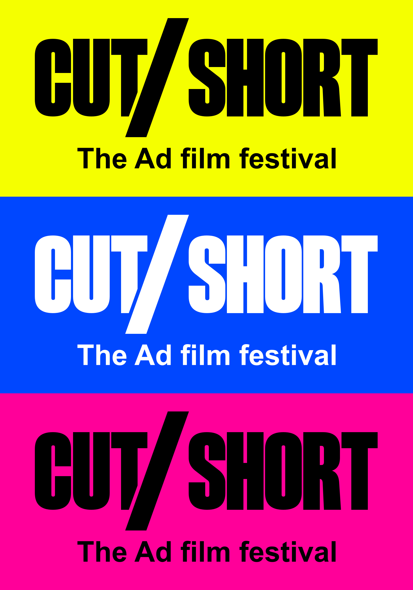

# CUT/SHORT — The Ad film festival

Primary: **black on electric yellow**. Secondary: **white on cobalt blue** and **black on hot pink**.

The approved concept has been rebuilt as custom vector outlines. No font installation is needed. The exact descriptor “The Ad film festival” is stored as outlines in `scripts/tagline-path.json`. The diagonal cut on the first T leaves a visible gap beside the oversized slash.

## Files

- `brand/svg`: scalable horizontal and stacked wordmarks, plus standalone slash. Five treatments: primary, blue, pink, transparent black and transparent white.
- `brand/png`: horizontal widths 160, 320, 640, 1280, 2560 and 4096 px; stacked and slash widths 128, 256, 512, 1024 and 2048 px. Black/white files have alpha transparency.
- `brand/webp`: lossless web exports at 1280 px wide.
- `brand/icons`: SVG favicons and square PNG slash icons at 16, 24, 32, 48, 64, 128, 180, 192, 256, 512 and 1024 px; multi-resolution ICO files.
- `brand/social`: 1080 x 1080 square, 1200 x 630 landscape and 1080 x 1920 story graphics, in all three brand colours.
- `brand/colors.json`: exact colour values.

## Colour values

| Colour | HEX | RGB |
| --- | --- | --- |
| Electric yellow | #F5FF00 | 245, 255, 0 |
| Cobalt blue | #0047FF | 0, 71, 255 |
| Hot pink | #FF0099 | 255, 0, 153 |
| Black | #000000 | 0, 0, 0 |
| White | #FFFFFF | 255, 255, 255 |

These are screen RGB masters. Have the printer proof bright colours on the intended paper/stock; select spot inks or an appropriate ICC conversion for the production process.

## Usage

Use yellow as the default identity. Blue and pink are secondary brand variations. Use transparent black or white over other suitable backgrounds. The slash always keeps its geometry and the logo must scale proportionally.

Prefer the complete horizontal lockup at 320 px wide or larger so the descriptor stays readable; use the standalone slash at favicon sizes. The 160 px export is supplied for compact applications, where the descriptor will be very small. The stacked wordmark is provided for narrow placements. Check small-size legibility in the actual medium. Built-in master padding is 80 design units (about one slash stroke); preserve at least that clear space around the mark.

The rounded corner and blue edge in the supplied screenshot were presentation framing, not part of the core wordmark. Every horizontal and stacked logo includes “The Ad film festival” beneath CUT/SHORT as vector outlines. The standalone slash remains the small-format symbol.

SVG is the resolution-independent master for websites, large posters and print layout. PNG sizes refer to total canvas width including clear space. White transparent artwork may appear blank against a white viewer background.

## Rebuild

Install Node.js dependencies with `npm install`, then run `npm run build`. The `CUT_SHORT_SHARP` environment variable can point to an existing Sharp installation. `scripts/package-brand.py` creates ICO files, verifies PNG integrity and bundles the assets with this guide into `cut-short-logo-suite.zip` (requires Pillow).

## Landing page

The responsive festival landing page is in `dist/`. It uses the approved logo files and brand colours, with mobile layouts, keyboard focus styles, working section navigation and a motion pause control. Reduced-motion preferences automatically disable animation.

Serve `dist` with any static web server. For example: `python -m http.server 4173 --directory dist`. There is no website build step and no third-party network dependency. For deployment, use `dist` as the publish directory. Pushing this repository does not itself configure hosting.

The landing page is for ad films, not a general short-film festival. Submissions are intended to use YouTube links; a receiving form or destination still needs to be connected. The page is currently a coming-soon launch: confirmed festival dates, location and the submission destination have not been provided. Edit `dist/index.html` when those details are ready. No email addresses are collected and no submission form is implied to work.

The browser check in `scripts/check-landing.cjs` uses Playwright and installed Chrome against a running local server on port 4173. Install Playwright separately or set `CUT_SHORT_PLAYWRIGHT` to an existing module path. Screenshots are saved in ignored `.qa/`. Checks cover desktop/mobile layout, asset loading, navigation, motion controls and reduced motion.
